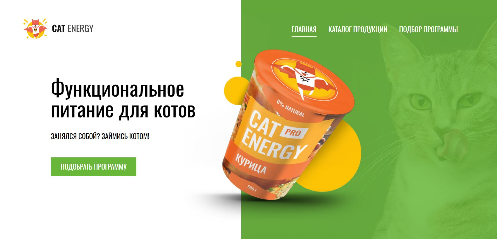

# 📋 Личный проект «Cat Energy»

**Адаптивный трёхстраничный сайт, написанный с использованием HTML, CSS и JavaScript в соответствии с техническим заданием, критериями качества HTML Academy, стайлгайдом, принципом Pixel Perfect.**

*Учебный проект, выполненный в рамках курса «Адаптивная вёрстка и автоматизация» HTML Academy.*



## 💡 Обзор выполненных задач

### ✔ Написание HTML-разметки
Создание семантически правильной и структурированной HTML-разметки, обеспечивающей доступность и SEO-оптимизацию. Страницы:
- главная
- каталог продукции
- подбор программы
Навигация из шапки и блока hero.

### ✔ Адаптивная верстка на SCSS
- **разработаны адаптивные стили** с использованием SCSS, обеспечивающих корректное отображение сайта на различных устройствах (desktop, tablet, mobile).
- **реализована резиновая верстка**, обеспечивающая масштабирование контента между брекпоинтами для гибкого отображения.
- **использован подход Mobile First**, гарантирующий оптимальное отображение на мобильных устройствах.

### ✔ Реализация JavaScript функциональности
- открытие/закрытие мобильного меню в шапке в мобильной версии.
- изменение вида кота в блоке «Живой пример».


## 🛠 Технологии и инструменты

- HTML5
- SCSS
- JavaScript (ES6+)
- БЭМ-методология
- SVG-спрайты, WebP
- оптимизация графики, в т.ч. для Retina-дисплеев
- резиновая верстка
- Git
- VS Code
- Figma


## 📌 Ссылка на проект

https://anastasiya-lemeshko.github.io/cat-energy/


## 🚀 Установка и запуск:

**Установка Node.js и NPM**:
- Установите Node.js (поддерживаемая версия 18+).
- Для установки зависимостей необходимо выполнить команду
```bash
npm i
```

**Запуск проекта**:
- Запустите сервер с помощью команды
```bash
npm run start
```
- Сервер будет доступен по адресу `http://localhost:3000`.
